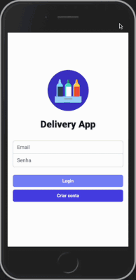
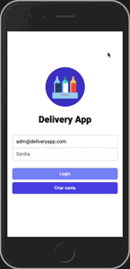

# Projeto Delivery App

-- Aguarde um momento... o projeto está em manutenção, estou fazendo alguns ajustes para funcionar corretamente no navegador, mas logo logo estará 100% :D
-- Enquanto isso, fique a vontade para ver o código feito pelo grupo.

Projeto de conclusão do bloco de Back-end da [Trybe](https://www.betrybe.com). Trabalho realizado em grupo de 5 estudantes.
O grupo foi responsável por criar e integrar tanto o back-end quanto o front-end, criando uma plataforma de delivery de cerveja.

## Autores

* [Ana Luisa M. Simões](https://github.com/analuisams99).   
* [Luiz Fernando C. Módolo](https://github.com/LuizModolo).   
* [Matheus Oliveira Monteiro](https://github.com/Matheus-Mont).   
* [Raphael Taglialegna](https://github.com/RaphaelTaglialegna).   
* [Wendel Melo](https://github.com/wendeldemelo).   

## Stacks utilizadas

<strong>Front-end:</strong> JavaScript, React.js, Tailwind, Axios, Jest   
<strong>Back-end:</strong> JavaScript, Node.js, Express, Joi, Sequelize, Mocha/Chai   
<strong>DB:</strong> MySQL  

## Estruturação do projeto

#### A aplicação tem 4 fluxos principais
* Fluxo Comum:   
    (1) Tela de Login   
    (2) Tela de Registro

* Fluxo do Cliente:   
    (3) Tela de Produtos   
    (4) Tela de Checkout   
    (5) Tela de Pedidos   
    (6) Tela de Detalhes do Pedido   
    
* Fluxo da Pessoa Vendedora:   
    (7) Tela de Pedidos;   
    (8) Tela de Detalhes/Controle do Pedido   

* Fluxo da Pessoa Administradora:   
    (10) Tela de gerenciamento de usuários.   


#### A tela de login é capaz de direcionar para a tela principal de cada pessoa usuária, sendo as páginas:   
    Do cliente: /customer/products,   
    Da pessoa vendedora: /seller/orders,    
    Da pessoa administradora: /admin/manage    
    

## Rodando localmente

Clone o projeto

```bash
  git clone git@github.com:analuisams99/project-delivery-app.git
```

Entre no diretório do projeto

```bash
  cd project-delivery-app
```

Instale as dependências

```bash
  npm install
```

Inicie o servidor

```bash
  cd back-end
  npm install
  npm db:reset
  npm run dev
  
  cd ..
  
  cd front-end
  npm install
  npm start
```

## Demonstração

Diagrama de ER
 
 
<div align="center">
  <div align="center">
    <p>Tela de fluxo do cliente</p>
    
    
  </div>
  
  <br>

  <div align="center">
    <p>Tela de fluxo do vendedor</p>
    
    
  </div>

<br>

  <div align="center">
    <p>Tela de fluxo do administrador</p>
    
    
  </div>
</div>
